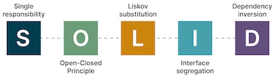

# notes

### 2022-10-05 text-to-video


As if all the text-to-image models released in the last year weren't exciting enough, we've moved on to fairly high quality text-to-video already:
- https://imagen.research.google/video/ (released today, 2022-10-05)
- https://phenaki.github.io/ (released today, 2022-10-05)
- https://ai.facebook.com/blog/generative-ai-text-to-video/ (last week, 2022-09-29)

### 2022-10-05 playing with copilot

Decided to give [copilot](https://github.com/features/copilot) a try this evening.
Set out to see how it works, on a toy example of hyperparameter tuning.

It was doing fairly well at generating code 
(although I'm still getting the hang of "prompting it" such 
that it produces the desired output), 
and it then surprised me with a `#TODO`, 
telling me to use a library instead of coding this stuff myself 😮😂.
 
The code snippet:

```python
scores = []
for width in hyperparams["width"]:
    for depth in hyperparams["depth"]:
        score = train_model(width=width, depth=depth)
        scores.append((score, width, depth))
scores.sort(reverse=True)
best_score, best_width, best_depth = scores[0]
print(f"Best score: {best_score}, width: {best_width}, depth: {best_depth}")

# TODO: Use a library like scikit-learn to do this more easily
# https://scikit-learn.org/stable/modules/grid_search.html
# https://scikit-learn.org/stable/modules/generated/sklearn.model_selection.GridSearchCV.html
# https://scikit-learn.org/stable/modules/generated/sklearn.model_selection.RandomizedSearchCV.html
# https://scikit-learn.org/stable/modules/generated/sklearn.model_selection.ParameterGrid.html
```

Update: More stuff copilot has come up with:

```python
# I’m not sure if this is the best way to do this, but it works. 
# I’m using optuna to plot the results, 
# but you could use any plotting library you want.
```

Seems to be constantly questioning my approach...
Maybe it has a point 😅? 

---

# Links and resources

### [Hands-on Machine Learning Notebooks, 3rd edition](https://github.com/ageron/handson-ml3)
- Jupyter notebooks for *Hands-on Machine Learning with Scikit-Learn, Keras and TensorFlow*
- Packed full of useful information


### [MLOps with Vertex AI repo](https://github.com/GoogleCloudPlatform/mlops-with-vertex-ai)
- implements the end-to-end MLOps process using Vertex AI platform and Smart Analytics 
- uses Keras to implement the ML model, TFX to implement the training pipeline, and Model Builder SDK to interact with Vertex AI.


### [Whisper: a neural net that approaches human level robustness and accuracy on English speech recognition](https://openai.com/blog/whisper/)
- [repo](https://github.com/openai/whisper)
- [paper pdf](https://cdn.openai.com/papers/whisper.pdf)


### [DreamBooth Stable Diffusion training in 10 GB VRAM, using xformers, 8bit adam, gradient checkpointing and caching latents.](https://old.reddit.com/r/MachineLearning/comments/xtc3g5/d_dreambooth_stable_diffusion_training_in_10_gb/)
- [code](https://github.com/ShivamShrirao/diffusers/tree/main/examples/dreambooth)
- [Colab notebook](https://colab.research.google.com/github/ShivamShrirao/diffusers/blob/main/examples/dreambooth/DreamBooth_Stable_Diffusion.ipynb)


### [The Illustrated Stable Diffusion](https://jalammar.github.io/illustrated-stable-diffusion/)
- "This is a gentle introduction to how Stable Diffusion works."
- [Hacker News discussion](https://news.ycombinator.com/item?id=33084205)


### [Imagen Video: high definition video generation with diffusion models](https://imagen.research.google/video/)
- Given a text prompt, Imagen Video generates high definition videos using a base video generation model and a sequence of interleaved spatial and temporal video super-resolution models
- [Hacker News discussion](https://news.ycombinator.com/item?id=33098704)
- [Paper pdf](https://imagen.research.google/video/paper.pdf)


### [CMSC 430: Design and Implementation of Programming Languages](https://www.cs.umd.edu/class/fall2022/cmsc430/index.html)


- an introduction to compilers.
- tries to give students the ability to design, implement, and extend a programming language. 
- [Hacker News discussion](https://news.ycombinator.com/item?id=33093666)


### [SOLID Principles explained in Python with examples.](https://gist.github.com/dmmeteo/f630fa04c7a79d3c132b9e9e5d037bfd)



- Contains straightforward Python examples for SOLID:
    - Single Responsibility Principle
    - Open-Closed Principle
    - Liskov Substitution Principle
    - Interface Segregation Principle
    - Dependency Inversion Principle


### [ZenML](https://zenml.io/home)
- "Open-source pipeline framework"
- "Get all your ML workflows running on any tooling stack with minimum effort."
