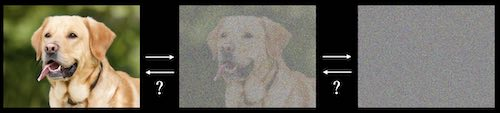

# Diffusion

## Resources

Code

- https://nn.labml.ai/diffusion/ddpm/index.html
- https://github.com/ageron/handson-ml3/blob/main/17_autoencoders_gans_and_diffusion_models.ipynb
- https://github.com/sradc/minDiffusion
- https://github.com/huggingface/diffusers
- https://github.com/CompVis/stable-diffusion

Videos

- [What are Diffusion Models? - Ari Seff](https://www.youtube.com/watch?v=fbLgFrlTnGU)
- [DDPM -  Yannic Kilcher](https://www.youtube.com/watch?v=W-O7AZNzbzQ)

Blogs

- https://www.assemblyai.com/blog/diffusion-models-for-machine-learning-introduction/
- https://huggingface.co/blog/annotated-diffusion
- https://jalammar.github.io/illustrated-stable-diffusion/

Papers

- [Understanding Diffusion Models: A Unified Perspective](https://arxiv.org/abs/2208.11970)
- [Denoising Diffusion Probabilistic Models](https://arxiv.org/abs/2006.11239)
- [Denoising Diffusion Implicit Models](https://arxiv.org/abs/2010.02502)
